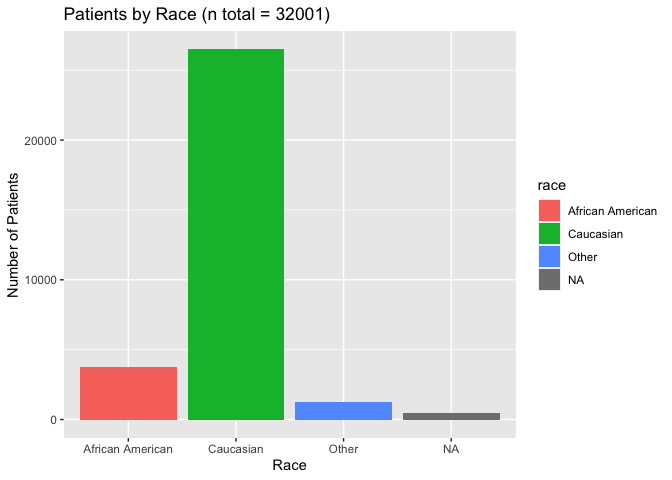
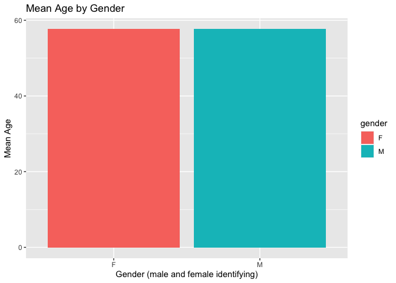
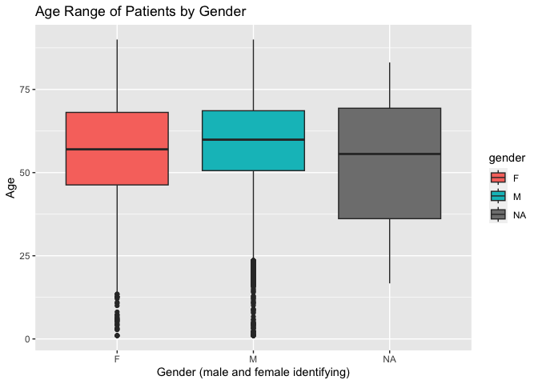
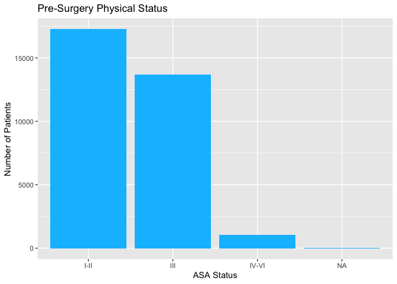
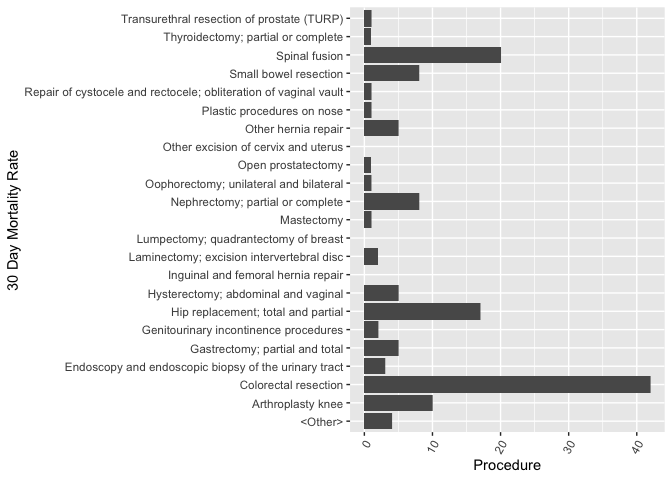
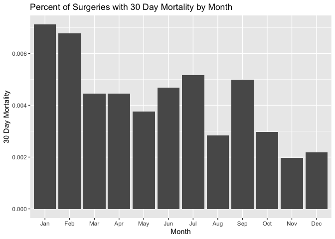
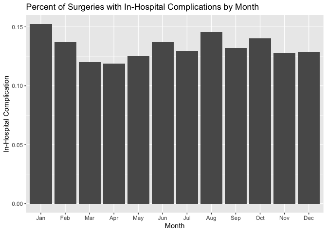

## Instructions
Answer the following questions and complete the exercises in RMarkdown. Please embed all of your code and push your final work to your repository. Your code should be organized, clean, and run free from errors. Remember, you must remove the `#` for any included code chunks to run. Be sure to add your name to the author header above.  

After the first 50 minutes, please upload your code (5 points). During the second 50 minutes, you may get help from each other- but no copy/paste. Upload the last version at the end of this time, but be sure to indicate it as final. If you finish early, you are free to leave.

Make sure to use the formatting conventions of RMarkdown to make your report neat and clean! Use the tidyverse and pipes unless otherwise indicated. To receive full credit, all plots must have clearly labeled axes, a title, and consistent aesthetics. This exam is worth a total of 35 points. 

Please load the following libraries.

```r
library("tidyverse")
library("janitor")
library("naniar")
```

## Data
These data are from a study on surgical residents. The study was originally published by Sessier et al. “Operation Timing and 30-Day Mortality After Elective General Surgery”. Anesth Analg 2011; 113: 1423-8. The data were cleaned for instructional use by Amy S. Nowacki, “Surgery Timing Dataset”, TSHS Resources Portal (2016). Available at https://www.causeweb.org/tshs/surgery-timing/.

Descriptions of the variables and the study are included as pdf's in the data folder.  

Please run the following chunk to import the data.

```r
surgery <- read_csv("data/surgery.csv")
```

1. (2 points) Use the summary function(s) of your choice to explore the data and get an idea of its structure. Please also check for NA's.

```r
str(surgery)
```

```
## spc_tbl_ [32,001 × 25] (S3: spec_tbl_df/tbl_df/tbl/data.frame)
##  $ ahrq_ccs           : chr [1:32001] "<Other>" "<Other>" "<Other>" "<Other>" ...
##  $ age                : num [1:32001] 67.8 39.5 56.5 71 56.3 57.7 56.6 64.2 66.2 20.1 ...
##  $ gender             : chr [1:32001] "M" "F" "F" "M" ...
##  $ race               : chr [1:32001] "Caucasian" "Caucasian" "Caucasian" "Caucasian" ...
##  $ asa_status         : chr [1:32001] "I-II" "I-II" "I-II" "III" ...
##  $ bmi                : num [1:32001] 28 37.9 19.6 32.2 24.3 ...
##  $ baseline_cancer    : chr [1:32001] "No" "No" "No" "No" ...
##  $ baseline_cvd       : chr [1:32001] "Yes" "Yes" "No" "Yes" ...
##  $ baseline_dementia  : chr [1:32001] "No" "No" "No" "No" ...
##  $ baseline_diabetes  : chr [1:32001] "No" "No" "No" "No" ...
##  $ baseline_digestive : chr [1:32001] "Yes" "No" "No" "No" ...
##  $ baseline_osteoart  : chr [1:32001] "No" "No" "No" "No" ...
##  $ baseline_psych     : chr [1:32001] "No" "No" "No" "No" ...
##  $ baseline_pulmonary : chr [1:32001] "No" "No" "No" "No" ...
##  $ baseline_charlson  : num [1:32001] 0 0 0 0 0 0 2 0 1 2 ...
##  $ mortality_rsi      : num [1:32001] -0.63 -0.63 -0.49 -1.38 0 -0.77 -0.36 -0.64 0.02 0.73 ...
##  $ complication_rsi   : num [1:32001] -0.26 -0.26 0 -1.15 0 -0.84 -1.34 0.09 0.02 0 ...
##  $ ccsmort30rate      : num [1:32001] 0.00425 0.00425 0.00425 0.00425 0.00425 ...
##  $ ccscomplicationrate: num [1:32001] 0.0723 0.0723 0.0723 0.0723 0.0723 ...
##  $ hour               : num [1:32001] 9.03 18.48 7.88 8.8 12.2 ...
##  $ dow                : chr [1:32001] "Mon" "Wed" "Fri" "Wed" ...
##  $ month              : chr [1:32001] "Nov" "Sep" "Aug" "Jun" ...
##  $ moonphase          : chr [1:32001] "Full Moon" "New Moon" "Full Moon" "Last Quarter" ...
##  $ mort30             : chr [1:32001] "No" "No" "No" "No" ...
##  $ complication       : chr [1:32001] "No" "No" "No" "No" ...
##  - attr(*, "spec")=
##   .. cols(
##   ..   ahrq_ccs = col_character(),
##   ..   age = col_double(),
##   ..   gender = col_character(),
##   ..   race = col_character(),
##   ..   asa_status = col_character(),
##   ..   bmi = col_double(),
##   ..   baseline_cancer = col_character(),
##   ..   baseline_cvd = col_character(),
##   ..   baseline_dementia = col_character(),
##   ..   baseline_diabetes = col_character(),
##   ..   baseline_digestive = col_character(),
##   ..   baseline_osteoart = col_character(),
##   ..   baseline_psych = col_character(),
##   ..   baseline_pulmonary = col_character(),
##   ..   baseline_charlson = col_double(),
##   ..   mortality_rsi = col_double(),
##   ..   complication_rsi = col_double(),
##   ..   ccsmort30rate = col_double(),
##   ..   ccscomplicationrate = col_double(),
##   ..   hour = col_double(),
##   ..   dow = col_character(),
##   ..   month = col_character(),
##   ..   moonphase = col_character(),
##   ..   mort30 = col_character(),
##   ..   complication = col_character()
##   .. )
##  - attr(*, "problems")=<externalptr>
```
NA represents NA's in this dataset.

2. (3 points) Let's explore the participants in the study. Show a count of participants by race AND make a plot that visually represents your output.

```r
surgery %>% 
  count(race)
```

```
## # A tibble: 4 × 2
##   race                 n
##   <chr>            <int>
## 1 African American  3790
## 2 Caucasian        26488
## 3 Other             1243
## 4 <NA>               480
```

```r
surgery %>% 
  count(race) %>% 
  ggplot(aes(x=race, y=n, fill=race))+
  geom_col()+
  labs(title = "Patients by Race (n total = 32001)",
       x = "Race",
       y = "Number of Patients")
```

<!-- -->

3. (2 points) What is the mean age of participants by gender? (hint: please provide a number for each) Since only three participants do not have gender indicated, remove these participants from the data.

```r
surgery %>% 
  filter(!is.na(gender)) %>% 
  count(mean_age = mean(age, na.rm=T), gender) %>% 
  ggplot(aes(x=gender, y=mean_age, fill=gender))+
  geom_col()+
  labs(title = "Mean Age by Gender",
       x = "Gender (male and female identifying)",
       y = "Mean Age")
```

<!-- -->

4. (3 points) Make a plot that shows the range of age associated with gender.

```r
surgery %>% 
  ggplot(aes(x=gender, y=age, fill=gender))+
  geom_boxplot()+
  labs(title = "Age Range of Patients by Gender",
       x = "Gender (male and female identifying)",
       y = "Age")
```

```
## Warning: Removed 2 rows containing non-finite values (`stat_boxplot()`).
```

<!-- -->

5. (2 points) How healthy are the participants? The variable `asa_status` is an evaluation of patient physical status prior to surgery. Lower numbers indicate fewer comorbidities (presence of two or more diseases or medical conditions in a patient). Make a plot that compares the number of `asa_status` I-II, III, and IV-V.

```r
surgery %>% 
  count(asa_status) %>% 
  ggplot(aes(x=asa_status, y=n, fill = asa_status))+
  geom_col(fill = "deepskyblue1")+
  labs(title = "Pre-Surgery Physical Status",
       x = "ASA Status",
       y = "Number of Patients")
```

<!-- -->

6. (3 points) Create a plot that displays the distribution of body mass index for each `asa_status` as a probability distribution- not a histogram. (hint: use faceting!)


```r
#surgery %>% 
  #ggplot(aes(y=bmi, x=asa_status))+
  #geom_density()+
  #facet_wrap(bmi~asa_status)+
  #labs(title="Pre-Surgery Status by Body Mass Index",
              #x = "ASA Status",
              #y = "Body Mass Index")
```


The variable `ccsmort30rate` is a measure of the overall 30-day mortality rate associated with each type of operation. The variable `ccscomplicationrate` is a measure of the 30-day in-hospital complication rate. The variable `ahrq_ccs` lists each type of operation.  

7. (4 points) What are the 5 procedures associated with highest risk of 30-day mortality AND how do they compare with the 5 procedures with highest risk of complication? (hint: no need for a plot here)

```r
surgery %>% 
  group_by(ahrq_ccs) %>% 
  summarize(mean_30day_mortality_rate = mean(ccsmort30rate)) %>% 
  arrange(desc(mean_30day_mortality_rate)) %>% 
  head(n=5)
```

```
## # A tibble: 5 × 2
##   ahrq_ccs                                             mean_30day_mortality_rate
##   <chr>                                                                    <dbl>
## 1 Colorectal resection                                                   0.0167 
## 2 Small bowel resection                                                  0.0129 
## 3 Gastrectomy; partial and total                                         0.0127 
## 4 Endoscopy and endoscopic biopsy of the urinary tract                   0.00811
## 5 Spinal fusion                                                          0.00742
```

```r
surgery %>% 
  group_by(ahrq_ccs) %>% 
  summarize(mean_30day_complication_rate = mean(ccscomplicationrate)) %>% 
  arrange(desc(mean_30day_complication_rate)) %>% 
  head(n=5)
```

```
## # A tibble: 5 × 2
##   ahrq_ccs                         mean_30day_complication_rate
##   <chr>                                                   <dbl>
## 1 Small bowel resection                                   0.466
## 2 Colorectal resection                                    0.312
## 3 Nephrectomy; partial or complete                        0.197
## 4 Gastrectomy; partial and total                          0.190
## 5 Spinal fusion                                           0.183
```

8. (3 points) Make a plot that compares the `ccsmort30rate` for all listed `ahrq_ccs` procedures.

```r
surgery %>% 
  ggplot(aes(x=ccsmort30rate, y=ahrq_ccs))+
  geom_col()+
  labs(x = "Procedure",
       y = "30 Day Mortality Rate")+
  theme(axis.text.x=element_text(angle = 60, hjust=1))
```

<!-- -->

9. (4 points) When is the best month to have surgery? Make a chart that shows the 30-day mortality and complications for the patients by month. `mort30` is the variable that shows whether or not a patient survived 30 days post-operation.

```r
surgery %>% 
  tabyl(complication, month)
```

```
##  complication  Apr  Aug  Dec  Feb  Jan  Jul  Jun  Mar  May  Nov  Oct  Sep
##            No 2377 2715 1602 2163 2263 2024 2584 2373 2321 2219 2312 2784
##           Yes  321  462  237  343  407  301  410  324  333  325  377  424
```

```r
surgery %>% 
  tabyl(mort30, month)
```

```
##  mort30  Apr  Aug  Dec  Feb  Jan  Jul  Jun  Mar  May  Nov  Oct  Sep
##      No 2686 3168 1835 2489 2651 2313 2980 2685 2644 2539 2681 3192
##     Yes   12    9    4   17   19   12   14   12   10    5    8   16
```

```r
surgery %>%
  count(month, mort30, complication)
```

```
## # A tibble: 48 × 4
##    month mort30 complication     n
##    <chr> <chr>  <chr>        <int>
##  1 Apr   No     No            2369
##  2 Apr   No     Yes            317
##  3 Apr   Yes    No               8
##  4 Apr   Yes    Yes              4
##  5 Aug   No     No            2708
##  6 Aug   No     Yes            460
##  7 Aug   Yes    No               7
##  8 Aug   Yes    Yes              2
##  9 Dec   No     No            1599
## 10 Dec   No     Yes            236
## # … with 38 more rows
```

10. (4 points) Make a plot that visualizes the chart from question #9. Make sure that the months are on the x-axis. Do a search online and figure out how to order the months Jan-Dec.

```r
mort_by_month <- surgery %>% 
  tabyl(month, mort30) %>% 
  adorn_percentages("row")
mort_by_month
```

```
##  month        No         Yes
##    Apr 0.9955523 0.004447739
##    Aug 0.9971671 0.002832861
##    Dec 0.9978249 0.002175095
##    Feb 0.9932163 0.006783719
##    Jan 0.9928839 0.007116105
##    Jul 0.9948387 0.005161290
##    Jun 0.9953240 0.004676019
##    Mar 0.9955506 0.004449388
##    May 0.9962321 0.003767898
##    Nov 0.9980346 0.001965409
##    Oct 0.9970249 0.002975084
##    Sep 0.9950125 0.004987531
```


```r
mort_by_month %>%
  ggplot(aes(x=month, y=Yes))+
  geom_col()+
  labs(title = "Percent of Surgeries with 30 Day Mortality by Month",
       x = "Month",
       y = "30 Day Mortality")+
  scale_x_discrete(limits=month.abb)
```

<!-- -->

```r
comp_by_month <- surgery %>% 
  tabyl(month, complication) %>% 
  adorn_percentages("row")
comp_by_month
```

```
##  month        No       Yes
##    Apr 0.8810230 0.1189770
##    Aug 0.8545798 0.1454202
##    Dec 0.8711256 0.1288744
##    Feb 0.8631285 0.1368715
##    Jan 0.8475655 0.1524345
##    Jul 0.8705376 0.1294624
##    Jun 0.8630595 0.1369405
##    Mar 0.8798665 0.1201335
##    May 0.8745290 0.1254710
##    Nov 0.8722484 0.1277516
##    Oct 0.8597992 0.1402008
##    Sep 0.8678304 0.1321696
```


```r
comp_by_month %>%
  ggplot(aes(x=month, y=Yes))+
  geom_col()+
  labs(title = "Percent of Surgeries with In-Hospital Complications by Month",
       x = "Month",
       y = "In-Hospital Complication")+
  scale_x_discrete(limits=month.abb)
```

<!-- -->

Please provide the names of the students you have worked with with during the exam:

Please be 100% sure your exam is saved, knitted, and pushed to your github repository. No need to submit a link on canvas, we will find your exam in your repository.
